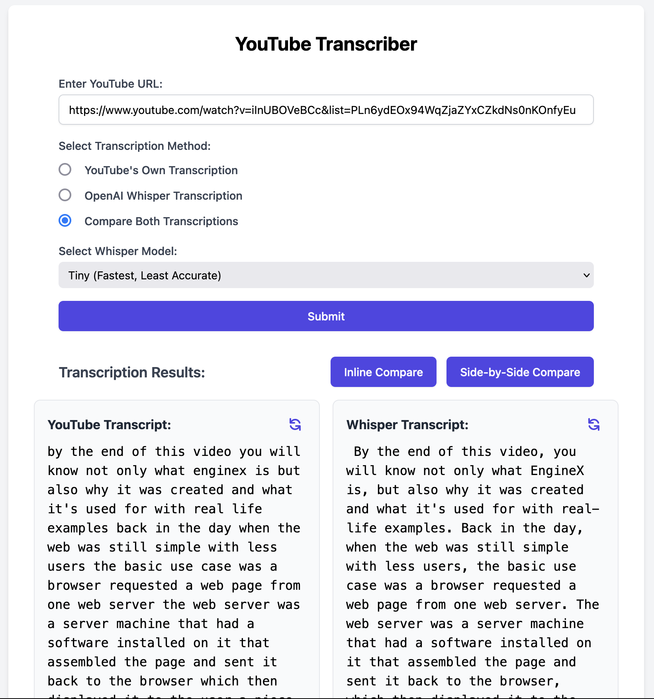

# YouTube Video Transcription Tool

<p align="center">
  
</p>

This Python project automates the process of downloading YouTube videos, extracting audio, and transcribing them using OpenAI's Whisper model or YouTube's auto-generated transcripts. The project works both as a **desktop application** (via PyWebView) and as a **web application** (via Flask).

## Features

- Download audio from YouTube videos.
- Transcribe audio using OpenAI's Whisper model with multiple model size options.
- Fetch YouTube's auto-generated transcripts.
- Compare transcriptions from both YouTube and Whisper side-by-side or inline.
- Run the app as both a desktop application (via PyWebView) and a web app (via Flask).
- Real-time progress updates using WebSockets.
- Responsive design for various screen sizes.
- Convert websites to PDFs with options for orientation and zoom using pyppeteer.
- Uses pyppeteer with browser extensions to hide cookie popups during PDF conversion.
- Browser extensions updating and version monitoring.


## Prerequisites

Before you begin, ensure you have met the following requirements:

- Python 3.7+ installed.
- [FFmpeg](https://ffmpeg.org/download.html) installed and available in your system's PATH.
  - On macOS, you can install FFmpeg using Homebrew:
    ```bash
    brew install ffmpeg
    ```

## Setup

1. **Clone the repository**:
    ```bash
    git clone https://github.com/yourusername/your-repository.git
    cd your-repository
    ```

2. **Create and activate a Python virtual environment**:
    ```bash
    python3 -m venv .venv
    source .venv/bin/activate  # macOS/Linux
    ```

3. **Install the required dependencies**:
    ```bash
    pip install -r requirements.txt
    ```

4. **Create a `.env` file**:
    The `.env` file is used to set the environment for the application. Create one in the root directory of the project with the following content:

    - For development:
      ```plaintext
      FLASK_ENV=development
      ```

    - For production:
      ```plaintext
      FLASK_ENV=production
      ```

## Running the Application

### Development Mode (with Hot Reload)

1. Set `FLASK_ENV=development` in your `.env` file.
2. Run the app:
   ```bash
   python app.py
   ```
3. Open the browser and go to `http://127.0.0.1:5000` to access the app.

### Production Mode (PyWebView Desktop App)

1. Set `FLASK_ENV=production` in your `.env` file.
2. Run the app:
   ```bash
   python app.py
   ```

The app will launch a native desktop window powered by PyWebView.

## Usage

1. Enter a YouTube URL in the input field.
2. Choose the transcription method:
    - **YouTube's Own Transcription**: Fetch the transcript directly from YouTube if available.
    - **OpenAI Whisper Transcription**: Download the audio and transcribe it using Whisper.
    - **Compare Both Transcriptions**: Generate both transcripts and allow comparison.
3. If using Whisper, select the model size (affects accuracy and speed).
4. Click "Submit" to start the transcription process.
5. View the results in the transcription results section.
6. Use the "Inline Compare" or "Side-by-Side Compare" buttons to compare transcriptions when both are available.
7. Use the "Refresh" button on individual transcripts to re-fetch or re-generate them.

## Comparison Features

- **Inline Comparison**: Shows differences between YouTube and Whisper transcripts in a single view. Deletions (words in YouTube but not in Whisper) are highlighted in red, while insertions (words in Whisper but not in YouTube) are highlighted in green.
- **Side-by-Side Comparison**: Displays YouTube and Whisper transcripts side by side, with differences highlighted in each.

## Dependencies

The project relies on the following Python libraries:
- Flask
- PyWebView
- youtube-transcript-api
- openai-whisper
- yt-dlp
- FFmpeg-python
- requests
- python-dotenv
- Flask-SocketIO
- pyppeteer
- aiohttp

## Contributing

If you'd like to contribute, please fork the repository and use a feature branch. Pull requests are warmly welcome.

## License

This project is open-source and available under the [MIT License](LICENSE).

Project layout:
tree -I "__pycache__|*.pyc|*.pyo|venv|.venv"
